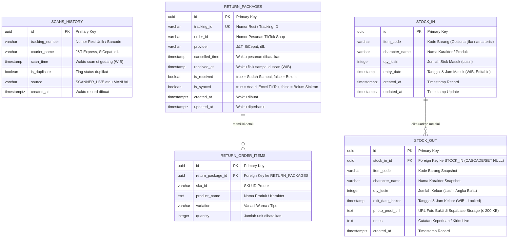

# 📊 Dokumentasi Pemetaan Skema Database Supabase (PostgreSQL)
**Aplikasi:** WebScan - Sistem Pemindai Resi, Manajemen Retur, & Inventaris Gudang

Dokumen ini berisi pemetaan lengkap seluruh entitas data, relasi (ERD), tipe data, constraint, index, view, dan konfigurasi Supabase Storage untuk seluruh halaman aplikasi.

---

## 🗺️ 1. Diagram Relasi Entitas (ERD - Entity Relationship Diagram)



---

## 📋 2. Rincian Tabel Per Halaman

### Halaman 1 & 2: Pemindai Live & Database Riwayat Scan (`/` & `/database`)

Tabel: `scans_history`
Menyimpan riwayat hasil pemindaian resi barcode USB secara real-time.

| Nama Kolom | Tipe Data PostgreSQL | Constraint | Keterangan |
| :--- | :--- | :--- | :--- |
| `id` | `UUID` | `PRIMARY KEY DEFAULT gen_random_uuid()` | ID unik record |
| `tracking_number` | `VARCHAR(100)` | `NOT NULL` | Nomor resi yang discan |
| `courier_name` | `VARCHAR(50)` | `NOT NULL` | Ekspedisi (`J&T Express`, `SiCepat`, `Ninja`, `Lainnya`) |
| `scan_time` | `TIMESTAMP` | `NOT NULL DEFAULT CURRENT_TIMESTAMP` | Waktu scan dalam format WIB |
| `is_duplicate` | `BOOLEAN` | `DEFAULT FALSE` | Penanda jika resi sudah pernah discan sebelumnya |
| `source` | `VARCHAR(30)` | `DEFAULT 'SCANNER_LIVE'` | Sumber entri (`SCANNER_LIVE`, `MANUAL_IMPORT`) |
| `created_at` | `TIMESTAMPTZ` | `DEFAULT NOW()` | Waktu sinkronisasi database |

---

### Halaman 3: Manajemen Retur Paket TikTok Shop (`/retur`)

#### Tabel Utama: `return_packages`
Menyimpan data induk paket retur TikTok Shop, status penerimaan fisik di gudang, dan sinkronisasi resi.

| Nama Kolom | Tipe Data PostgreSQL | Constraint | Keterangan |
| :--- | :--- | :--- | :--- |
| `id` | `UUID` | `PRIMARY KEY DEFAULT gen_random_uuid()` | ID unik paket |
| `tracking_id` | `VARCHAR(100)` | `NOT NULL UNIQUE` | Nomor resi / Tracking ID paket retur |
| `order_id` | `VARCHAR(100)` | `NULL` | Nomor Order ID TikTok Shop |
| `provider` | `VARCHAR(50)` | `NOT NULL DEFAULT 'Lainnya'` | Ekspedisi (J&T, SiCepat, J&T Cargo, dll.) |
| `cancelled_time` | `TIMESTAMP` | `NULL` | Tanggal & jam pembatalan pesanan di TikTok |
| `received_at` | `TIMESTAMP` | `NULL` | Tanggal & jam fisik paket tiba discan di gudang (WIB) |
| `is_received` | `BOOLEAN` | `NOT NULL DEFAULT FALSE` | Status fisik: `TRUE` (Sudah Sampai), `FALSE` (Belum Sampai) |
| `is_synced` | `BOOLEAN` | `NOT NULL DEFAULT TRUE` | `TRUE` (Ada di data TikTok), `FALSE` (Scan fisik duluan/Belum Sinkron) |
| `raw_payload` | `JSONB` | `DEFAULT '{}'` | Metadata mentah baris Excel untuk kebutuhan audit lanjutan |
| `created_at` | `TIMESTAMPTZ` | `DEFAULT NOW()` | Waktu import awal |
| `updated_at` | `TIMESTAMPTZ` | `DEFAULT NOW()` | Waktu pembaruan status |

#### Tabel Rincian Produk: `return_order_items`
Menyimpan item SKU / variasi karakter dari pesanan yang dibatalkan (1 nomor pesanan bisa berisi > 1 produk).

| Nama Kolom | Tipe Data PostgreSQL | Constraint | Keterangan |
| :--- | :--- | :--- | :--- |
| `id` | `UUID` | `PRIMARY KEY DEFAULT gen_random_uuid()` | ID unik item |
| `return_package_id`| `UUID` | `REFERENCES return_packages(id) ON DELETE CASCADE` | Relasi ke paket retur induk |
| `sku_id` | `VARCHAR(100)` | `NULL` | Kode SKU Seller / Platform |
| `product_name` | `TEXT` | `NOT NULL` | Nama barang / karakter |
| `variation` | `VARCHAR(100)` | `NULL` | Variasi warna / ukuran |
| `quantity` | `INTEGER` | `NOT NULL DEFAULT 1` | Jumlah produk dibatalkan |

---

### Halaman 4: Manajemen Stok Masuk (`/stok-masuk`)

Tabel: `stock_in`
Menyimpan master inventaris barang masuk ke gudang dalam satuan **Lusin**.

| Nama Kolom | Tipe Data PostgreSQL | Constraint | Keterangan |
| :--- | :--- | :--- | :--- |
| `id` | `UUID` | `PRIMARY KEY DEFAULT gen_random_uuid()` | ID unik stok masuk |
| `item_code` | `VARCHAR(50)` | `NULL` | Kode Barang (misal: `BRG-01`, `KRM-01`) |
| `character_name` | `VARCHAR(150)` | `NULL` | Nama Karakter / Produk (misal: `Kuromi Purple`) |
| `qty_lusin` | `INTEGER` | `NOT NULL CHECK (qty_lusin > 0)` | **Jumlah Stok Masuk (Lusin, Angka Bulat)** |
| `entry_date` | `TIMESTAMP` | `NOT NULL DEFAULT CURRENT_TIMESTAMP` | Tanggal & Jam Masuk (WIB, bisa diedit oleh admin) |
| `created_at` | `TIMESTAMPTZ` | `DEFAULT NOW()` | Waktu pembuatan record |
| `updated_at` | `TIMESTAMPTZ` | `DEFAULT NOW()` | Waktu update data |

> **Aturan Validasi Bisnis:** Minimal salah satu dari `item_code` atau `character_name` harus terisi (`CHECK (item_code IS NOT NULL OR character_name IS NOT NULL)`).

---

### Halaman 5: Manajemen Stok Keluar (`/stok-keluar`)

Tabel: `stock_out`
Menyimpan transaksi pengeluaran barang oleh karyawan gudang yang terhubung langsung ke master `stock_in`.

| Nama Kolom | Tipe Data PostgreSQL | Constraint | Keterangan |
| :--- | :--- | :--- | :--- |
| `id` | `UUID` | `PRIMARY KEY DEFAULT gen_random_uuid()` | ID unik transaksi keluar |
| `stock_in_id` | `UUID` | `REFERENCES stock_in(id) ON DELETE CASCADE` | **Relasi Foreign Key ke master Stok Masuk** |
| `item_code` | `VARCHAR(50)` | `NULL` | Snapshot Kode Barang saat dikeluarkan |
| `character_name` | `VARCHAR(150)` | `NULL` | Snapshot Nama Karakter saat dikeluarkan |
| `qty_lusin` | `INTEGER` | `NOT NULL CHECK (qty_lusin > 0)` | **Jumlah Keluar (Lusin, Angka Bulat)** |
| `exit_date_locked` | `TIMESTAMP` | `NOT NULL DEFAULT CURRENT_TIMESTAMP` | **Waktu Keluar (WIB, TERKUNCI / Read-Only)** |
| `photo_proof_url` | `TEXT` | `NOT NULL` | **Foto Bukti Pengeluaran (Wajib, Simpan di Supabase Storage)** |
| `notes` | `TEXT` | `NULL` | Catatan keperluan (Live TikTok, display, pesanan) |
| `created_by` | `UUID` | `NULL` | ID Pengguna/Karyawan Supabase Auth (opsional) |
| `created_at` | `TIMESTAMPTZ` | `DEFAULT NOW()` | Waktu input transaksi |

---

## 🔄 3. Database Views (Otomatisasi Perhitungan)

### View Sisa Stok Gudang Real-time: `view_inventory_stock_summary`
View ini secara otomatis menghitung akumulasi keluar dan sisa stok fisik tanpa perlu query manual yang rumit di frontend:

```sql
CREATE OR REPLACE VIEW view_inventory_stock_summary AS
SELECT 
    si.id,
    si.item_code,
    si.character_name,
    si.qty_lusin AS total_masuk_lusin,
    COALESCE(SUM(so.qty_lusin), 0) AS total_keluar_lusin,
    (si.qty_lusin - COALESCE(SUM(so.qty_lusin), 0)) AS sisa_stok_lusin,
    si.entry_date,
    si.created_at,
    si.updated_at
FROM stock_in si
LEFT JOIN stock_out so ON si.id = so.stock_in_id
GROUP BY si.id, si.item_code, si.character_name, si.qty_lusin, si.entry_date, si.created_at, si.updated_at;
```

---

## 🗄️ 4. Konfigurasi Supabase Storage Bucket

Untuk menyimpan **Foto Bukti Pengeluaran Stok Keluar (Maksimal 200 KB)**:

1. **Bucket Name**: `stock-out-proofs`
2. **Public Access**: `TRUE` (atau via signed URL)
3. **File Size Limit**: `204800` Bytes (200 KB)
4. **Allowed MIME Types**: `image/jpeg`, `image/png`, `image/webp`
5. **Path Structure**: `{YYYY}/{MM}/{stock_out_id}_{timestamp}.webp`
